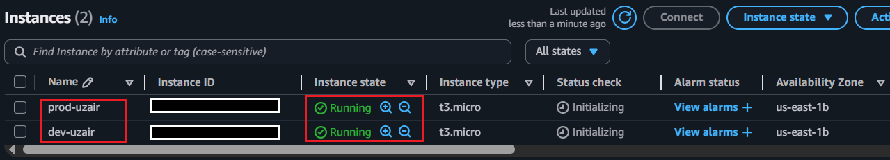
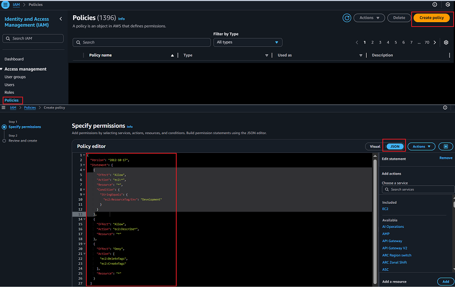
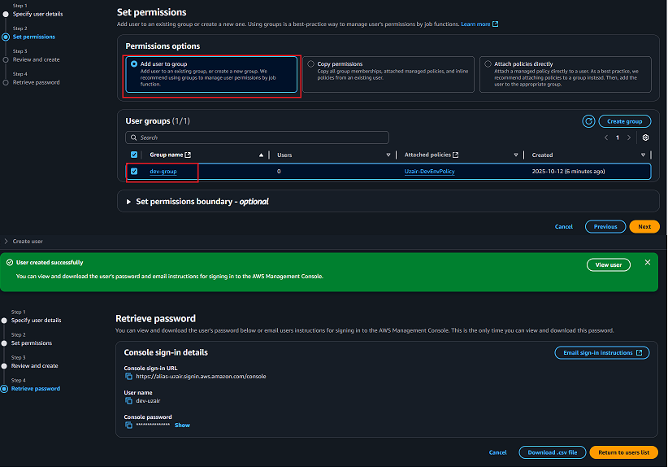
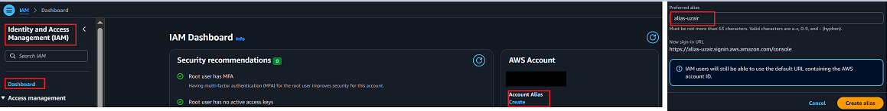
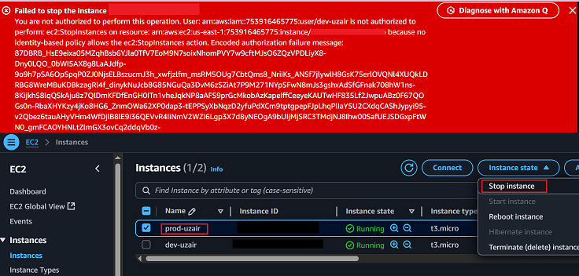

# Cloud Security with AWS IAM (Managing Access to AWS Resources)
Securing AWS resources by managing access with IAM policies, ensuring controlled permissions for users across different environments.

## Overview

This project focuses on **Cloud Security** using **AWS Identity and Access Management (IAM)** to control and manage access to AWS resources. AWS IAM allows administrators to define policies for users, groups, and roles to ensure that only authorized individuals have access to specific resources.

In this project, the objective was to demonstrate how IAM can be used to manage permissions effectively, focusing on tasks such as:

- **Setting Up EC2 instances** for different environments (production and development).
- **Onboarding a new intern** with controlled access to the development environment while restricting access to the production environment.
- **Testing IAM policies** to ensure that users can only access the resources they are authorized to use.

<div align="center">
  
</div>

## Tools and Services Used

**Amazon EC2** : To provision virtual machines for both production and development environments.  
**AWS IAM (Identity and Access Management)**: To define user permissions and manage access control policies.

## Architecture Overview

**Production Environment**: A fully operational EC2 instance.  
**Development Environment:** A separate EC2 instance where the intern can safely experiment and test features without affecting the production environment.

## Methodology

### 1- Launching EC2 Instances
Launched two EC2 instances with the following configurations:

**Production Instance:**
Tagged with Env: production

**Development Instance:**
Tagged with Env: development

_Both instances were tagged to easily identify and separate them based on the environment._

***

<div align="center">
  
</div>

***
***

<div align="center">
  
</div>

***
### 2- Creating IAM Policy

Created a custom IAM policy to grant the intern restricted access:

- Allow access only to EC2 instances tagged with Env: development.
- Deny access to EC2 instances tagged with Env: production.
- Prevent the creation and deletion of tags on instances, regardless of the environment.
```bash
  Script can be found in  `Script` file 
```

***
<div align="center">
  
  
</div>

***
***

<div align="center">
  
</div>

***

### 3- Setting Up IAM User and Group

Created an IAM group and attached the IAM policy for development access.  

Created an IAM user for the intern with access to the AWS Management Console:  

The intern was added to the nextwork-dev-group, ensuring that they inherit the correct permissions.

***

<div align="center">
  
</div>

***
***

<div align="center">
  
</div>

***
***

<div align="center">
  
</div>

***

### 4- Creating Account Alias for Easier Login

To simplify login for the intern, I created an Account Alias (alias-name) which allows the intern to log in using a friendly URL instead of a complicated account ID.

***
<div align="center">
  
</div>

***

### 5- Testing Intern’s Access

Tested access to ensure the intern could:

- Access the development instance.

- Not access or modify the production instance.

***
<div align="center">
  
</div>

***
***
<div align="center">
  
</div>

***
***
<div align="center">
  
</div>

***

## Conclusion

This project successfully established a secure environment for the intern to work in while maintaining the integrity of the production system. By leveraging AWS IAM and EC2 instances, we ensured that the intern’s access was both secure and limited to only what was necessary for their tasks.

## Acknowledgments

A special thanks to **[NextWork](https://learn.nextwork.org/)** for providing the guidance and resources that helped shape this project. Their comprehensive framework on cloud security and IAM best practices was invaluable. 

Feel free to join me in exploring more on **NextWork** to dive deeper into AWS and cloud security concepts!


